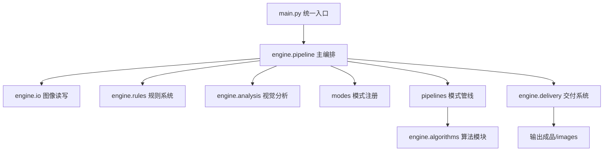

# VisualMasterPro 技术架构说明

本文档面向中国开发者、AI 视觉工具开发者和商业视觉系统维护人员，用中文说明 VisualMasterPro 的系统结构、模块关系和未来技术方向。

## 系统架构

VisualMasterPro 不是单脚本工具，而是由入口层、规则层、分析层、算法层、模式管线层和交付层组成的 AI 商业视觉质量引擎。

```text
VisualMasterPro/
├── main.py
├── engine/
│   ├── algorithms/
│   ├── analysis/
│   ├── config/
│   ├── delivery/
│   ├── io/
│   ├── pipeline/
│   └── rules/
├── pipelines/
├── modes/
├── rules/
├── ai_noise_rules/
├── material_rules/
├── visual_style_rules/
├── configs/
├── docs/
├── tests/
├── 输入图片/
└── 输出成品/
```

## 模块关系



## 图像处理流程

1. 解析输入路径、输出路径和 mode。
2. 使用中文路径兼容方式读取图像。
3. 加载视觉规则库。
4. 分析画面质量，包括 AI 脏感、高频污染、中频结构、高光风险、色彩统一和空气感。
5. 根据用户指定或自动分析选择 mode。
6. 生成 ProcessingStrategy。
7. 放大到目标尺寸。
8. 执行对应 mode pipeline。
9. 生成内部 quality_report。
10. 添加商业信息角标。
11. 输出最终商业交付图。
12. 在 debug/developer 模式下额外输出 JSON、Markdown 和 compare 图。

## 商业签名引擎

商业签名引擎是 V3.7 的核心方向，用于让每个商业 mode 拥有稳定、可复用、可收费的视觉风格。

```text
规则库 + 视觉分析 + mode
        ↓
ProcessingStrategy
        ↓
商业签名 Profile
        ↓
品牌预设 Preset
        ↓
Mode Pipeline
        ↓
最终商业交付图
```

### 商业签名 Profile 负责内容

- 品牌色彩倾向。
- 光影风格。
- 材质优先级。
- 细节节奏。
- 高频控制强度。
- 中频结构恢复目标。
- 输出交付标准。

## 预设系统

预设系统用于将复杂商业视觉经验沉淀为可复用的风格方案。

未来推荐结构：

```text
presets/
├── 免费版/
├── 创作者版/
├── 工作室版/
└── 企业版/
```

### 预设类型

- 高端化妆品预设。
- 食品海报预设。
- 奢侈品黑金预设。
- 商业人像预设。
- 建筑空间预设。
- PPT 商业封面预设。

## GPU 处理流程

当前 V3.x 以 CPU 与 OpenCV 为主，后续可升级为 GPU 加速流程。

未来 GPU 方向：

- GPU 降噪。
- GPU 色彩变换。
- GPU 放大。
- 8K 分块处理。
- 实时预览。
- RTX 加速支持。

可评估技术：

- OpenCV CUDA。
- ONNX Runtime GPU。
- PyTorch 推理层。
- Windows DirectML。

## AI 增强逻辑

未来 AI 增强逻辑建议拆分为以下层：

```text
AI 场景理解
        ↓
主体识别
        ↓
材质识别
        ↓
商业构图判断
        ↓
光影重建
        ↓
品牌预设匹配
        ↓
专业输出
```

## 质量报告系统

`quality_report` 默认作为内部系统使用。

它负责：

- 商业高级感评分。
- AI 脏感风险。
- 高频污染风险。
- 中频结构评分。
- 高光风险。
- 色彩统一评分。
- 空气感评分。
- 推荐 mode。
- 策略记录。

在 debug/developer 模式下，可导出为 JSON 和 Markdown。

## 交付系统

`engine/delivery/` 负责最终输出行为。

当前模块：

- `badge.py`：商业信息角标。
- `compare.py`：开发调试对比图。

默认交付原则：

- 用户只看到最终图。
- 工程报告不进入正式输出。
- 调试文件只在开发模式输出。

## 扩展原则

- 新算法放入 `engine/algorithms/`。
- 新模式管线放入 `pipelines/`。
- 新视觉模式放入 `modes/`。
- 新全局规则放入 `rules/`。
- AI 脏感经验放入 `ai_noise_rules/`。
- 材质经验放入 `material_rules/`。
- 商业风格经验放入 `visual_style_rules/`。
